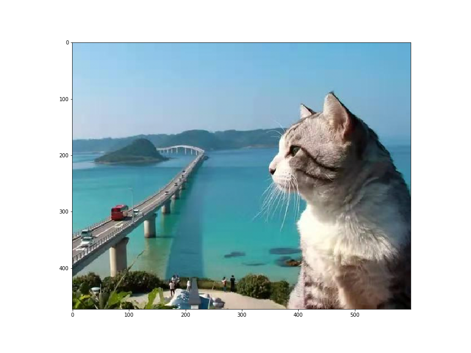
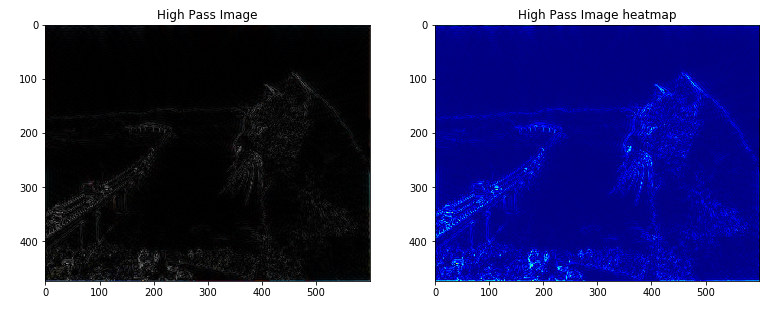

# FFT in CV

Here is a demo for HP and LP filter in image processing.

## Requirements

```bash
opencv-python
matplotlib
numpy
```

## How to Play?

**Step 1:** install `jupyter-notebook` for python

**Step 2:** run `jupyter-notebook fft_cv.ipynb` in your Terminal/CMD/PowerShell

or

Just open `ffv_cv.ipynb` in your `vs code` (highly recommended!!)


For more details, please refer to `fft_cv.ipynb`


## Fast glance

### Input Image



### LP Image


### HP image

